# MyBooking Backend - Laravel API

This is the **backend** for the MyBooking project, a booking management system for hospitality businesses, built with **Laravel**, **MySQL**, and **Sanctum** for authentication.

🔗 **Frontend repo:** [mybooking-frontend-react](https://github.com/guduchango/mybooking-frontend-react)  
🌐 **Live demo:** [mybooking.edgardoponce.com](https://mybooking.edgardoponce.com/)  
👤 **Website:** [edgardoponce.com](https://edgardoponce.com/)

---

## 📦 Features

✅ RESTful API built with Laravel  
✅ Token-based authentication with Laravel Sanctum  
✅ CRUD endpoints for guests, units, reservations, unit prices  
✅ Price management with calendar-based pricing per unit/day  
✅ Multi-user support  
✅ Offline support via IndexedDB (frontend)  
✅ Seeders and factories for testing data  
✅ Clean object-oriented architecture

---

## 🛠️ How to run the project
The backend is a Laravel API. Clone the repository:

```
git clone https://github.com/guduchango/mybooking-backend-laravel.git
cd mybooking-backend-laravel
```

Install PHP dependencies:

```
composer install
```

Copy the environment file and configure the database:

```
cp .env.example .env
```

Edit `.env` with your credentials and generate the application key:

```
php artisan key:generate
```

Run migrations and seeders:

```
php artisan migrate --seed
```

Start the server:

```
php artisan serve
```

The API will be available at: http://127.0.0.1:8000

### 📂 Laravel folder structure

- app/Http/Controllers       HTTP controllers
- app/Models                 Eloquent models
- database/factories         Test data factories
- database/seeders           Database seeders
- routes/                    Route definitions
- storage/                   Files and logs

---

## 📸 Project Screenshots

Below you can find screenshots showcasing the main views and functionalities of the MyBooking app.

---

### 🔑 Authentication

<p align="center">
  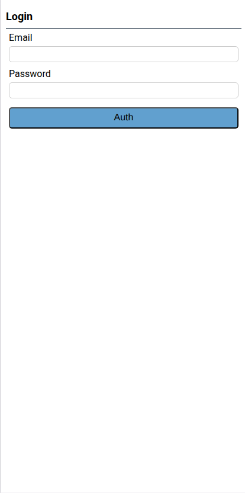
</p>

---

### 🏠 Dashboard

<p align="center">
  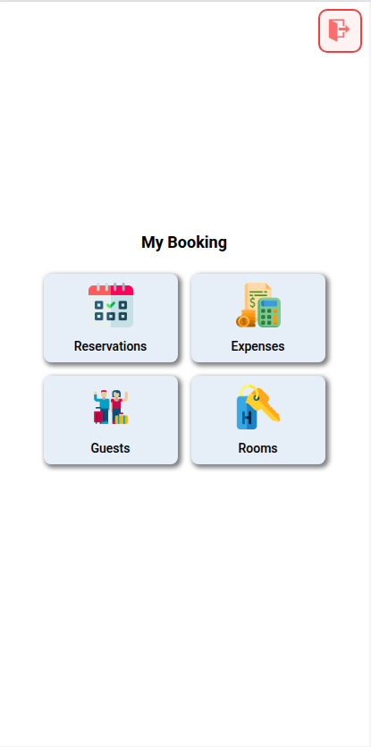
</p>

---

### 👥 Guest Management

<p align="center">
  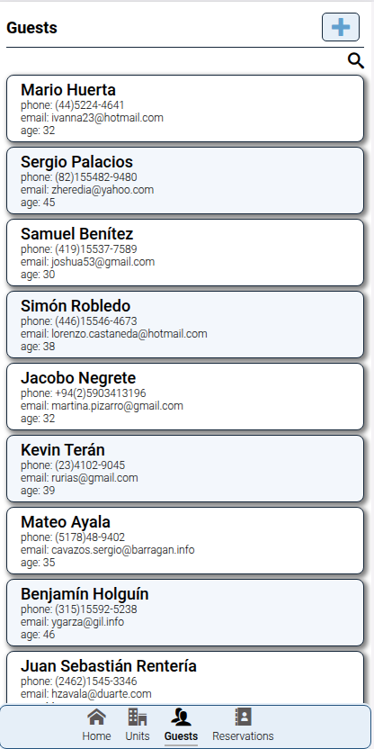
</p>

<p align="center">
  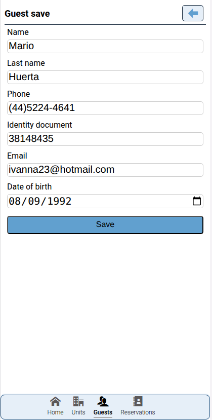
</p>

---

### 🏘️ Unit Management

<p align="center">
  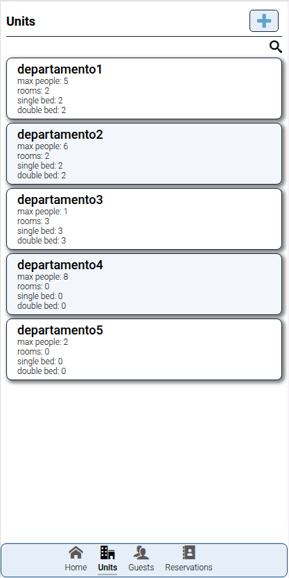
</p>

<p align="center">
  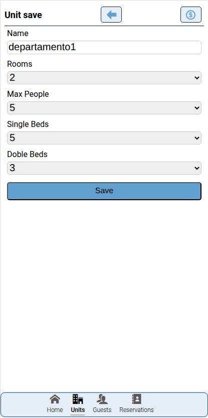
</p>

<p align="center">
  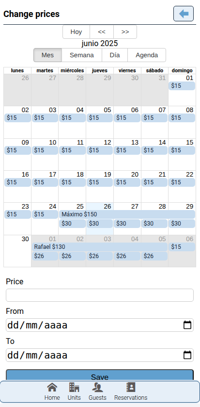
</p>

---

### 📅 Reservation Management

<p align="center">
  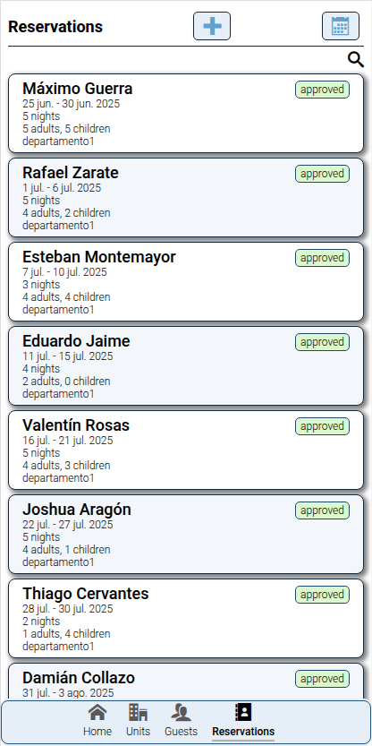
</p>

<p align="center">
  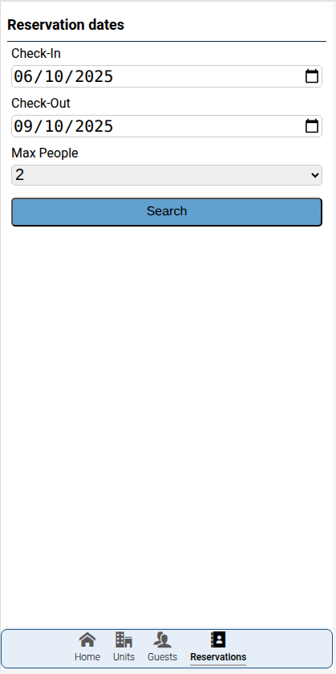
</p>

<p align="center">
  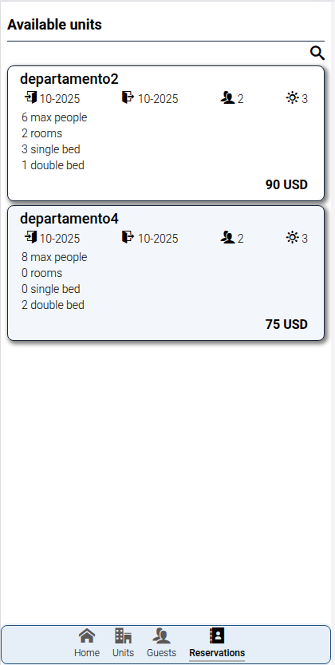
</p>

<p align="center">
  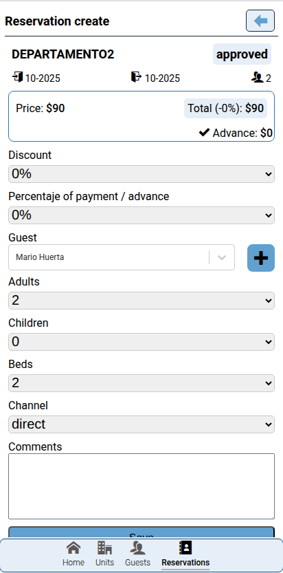
</p>

<p align="center">
  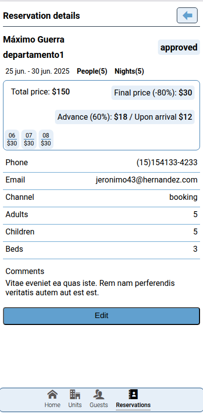
</p>


---


## 🎯 How to contribute

If you’d like to collaborate:

1. Fork the repository
2. Create a new branch with your improvement or fix
3. Submit a pull request describing your changes

Direct contact: you can write to me through my website https://edgardoponce.com or open an issue on the repository.

---

## 🗒 Task board (Kanban / Tickets)

Currently, there is no public task board.  
I’m considering using GitHub Projects to manage tasks collaboratively.

---

## 📄 License

This project is available under the MIT license.

---

## 🙏 Acknowledgments

Thanks to all the open source technologies and libraries that make this project possible.
